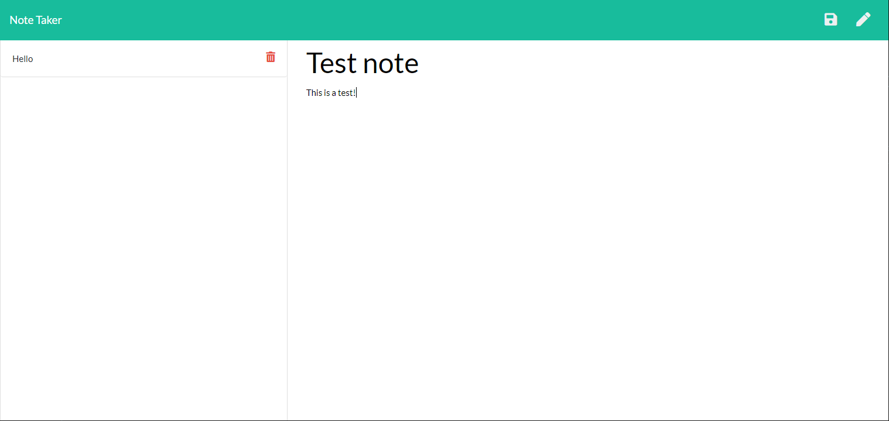

# 11_note_taker

## Description

Note taker is a simple application that uses express to take, save, and delete notes that may include a header and a body, all in a sleek easy to use design.

## User Story

AS A user, I want to be able to write and save notes

I WANT to be able to delete notes I've written before

SO THAT I can organize my thoughts and keep track of tasks I need to complete

## Instructions 

Please click on the Heroku link, or open the command line in the server.js file and enter "node server.js". then in your browser enter "localhost:8080" and hit enter.

## Links 
* Github: https://github.com/Henryrjung/11_note_taker
* Heroku: 
## Screenshot 

 

## Credits 
* Class-repo
* W3 Schools
